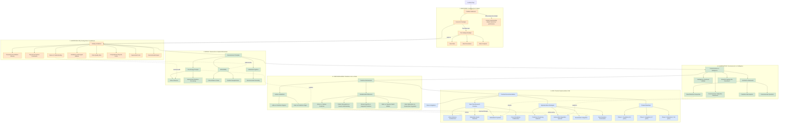

```mermaid
flowchart TD
    %% Main narrative flow
    Start[Landing Page] --> Problem[Problem Statement]
    Problem --> CurrentState[Current AI Paradigm]
    CurrentState --> Limitations[Scaling Limitations]
    Limitations --> AlternativeApproach[Neuroscience Principles]
    AlternativeApproach --> KeyDistinction[Consciousness vs Intelligence]
    KeyDistinction --> CoreMechanism[Prediction Mechanisms]
    CoreMechanism --> Solutions[Practical Recommendations]
    Solutions --> FutureVision[Future Integration]

    %% Detailed Sections
    subgraph "1. BEGINNING: Identifying the Problem"
        Problem --> |"Why current AI is limited"| ProblemDefinition["Limited understanding despite impressive performance"]
        CurrentState --> |"The status quo"| ScalingParadigm["The Scaling Paradigm"]
        ScalingParadigm --> MoreData["More Data"]
        ScalingParadigm --> MoreParams["More Parameters"]
        ScalingParadigm --> MoreCompute["More Compute"]
    end

    subgraph "2. LIMITATIONS: Why Scaling Alone Is Insufficient"
        Limitations --> TheoreticalLimits["Theoretical Foundations Missing"]
        Limitations --> PhysicalLimits["Physical & Practical Constraints"]
        Limitations --> IllusionUnderstanding["Illusion of Understanding"]
        Limitations --> EmergentLimits["Limitations of Emergent Abilities"]
        Limitations --> DataLimits["Finite Quality Data"]
        Limitations --> ComputeLimits["Computational Physical Limits"]
        Limitations --> EconomicLimits["Exponential Costs"]
        Limitations --> EnvironmentalLimits["Environmental Impact"]
    end

    subgraph "3. MIDDLE: Neuroscience-Inspired Alternatives"
        AlternativeApproach --> FEP["Free Energy Principle"]
        AlternativeApproach --> Metastability["Metastability"]
        AlternativeApproach --> EmbodiedCognition["Embodied Cognition"]
        
        FEP --> ActiveInference["Active Inference"]
        FEP --> HierarchicalPrediction["Hierarchical Predictive Processing"]
        Metastability --> Criticality["Critical States in Brain"]
        Metastability --> FlexibleReorganization["Flexible Reorganization"]
        EmbodiedCognition --> EnvironmentalGrounding["Environmental Grounding"]
    end

    subgraph "4. CLARIFICATION: Consciousness vs. Intelligence"
        KeyDistinction --> IntelligenceDef["Intelligence: Functional Abilities"]
        KeyDistinction --> ConsciousnessDef["Consciousness: Subjective Experience"]
        KeyDistinction --> SethFramework["Anil Seth's Framework"]
        KeyDistinction --> ApplicationsQuestion["Should AI Systems Be Conscious?"]
        
        SethFramework --> BeastMachine["Beast Machine Perspective"]
        SethFramework --> PredictiveInteroception["Predictive Interoception"]
        SethFramework --> ConsciousnessSpectrum["Consciousness Spectrum"]
    end

    subgraph "5. CORE MECHANISM: Prediction in AI vs. Brain"
        CoreMechanism --> SurfaceSimilarities["Surface Similarities"]
        CoreMechanism --> FundamentalDifferences["Fundamental Differences"]
        
        SurfaceSimilarities --> PredictionEngines["LLMs as Prediction Engines"]
        SurfaceSimilarities --> PredictiveBrain["Brain as Prediction Organ"]
        
        FundamentalDifferences --> ActiveVsPassive["Active vs. Passive Prediction"]
        FundamentalDifferences --> PatternVsCausal["Pattern Recognition vs. Causal Understanding"]
        FundamentalDifferences --> DomainVsIntegrated["Domain-Specific vs. Integrated Prediction"]
        FundamentalDifferences --> StaticVsDynamic["Static vs. Dynamic World Models"]
        FundamentalDifferences --> DataVsHomeostasis["Data Optimization vs. Homeostatic Regulation"]
    end

    subgraph "6. END: Practical Implementation Path"
        Solutions --> ResearchPriorities["Near-Term Research Priorities"]
        Solutions --> ImplementationStrategies["Implementation Strategies"]
        Solutions --> RoadmapPhases["Phased Roadmap"]
        
        ResearchPriorities --> ActiveInferenceArch["Active Inference Architectures"]
        ResearchPriorities --> MetastableNetworks["Metastable Neural Networks"]
        ResearchPriorities --> EmbodiedSystems["Embodied AI Systems"]
        ResearchPriorities --> CrossDisciplinary["Cross-Disciplinary Collaboration"]
        
        ImplementationStrategies --> PredictiveNetworks["Predictive Processing Networks"]
        ImplementationStrategies --> HomeostasisSystems["Homeostatic Regulation Systems"]
        ImplementationStrategies --> SensorimotorFrameworks["Sensorimotor Integration"]
        ImplementationStrategies --> EvaluationFrameworks["New Evaluation Frameworks"]
        
        RoadmapPhases --> Phase1["Phase 1: Foundation (0-3 years)"]
        RoadmapPhases --> Phase2["Phase 2: Integration (3-7 years)"]
        RoadmapPhases --> Phase3["Phase 3: Maturation (7-15 years)"]
    end

    %% Major connections between sections (connecting the narrative)
    ScalingParadigm -.-> |"leads to"| Limitations
    IllusionUnderstanding -.-> |"contrasts with"| ActiveInference
    EmergentLimits -.-> |"addressed by"| Metastability
    FEP -.-> |"explains"| PredictiveBrain
    ActiveVsPassive -.-> |"informs"| ActiveInferenceArch
    PatternVsCausal -.-> |"addressed by"| PredictiveNetworks
    DomainVsIntegrated -.-> |"improved through"| SensorimotorFrameworks
    ConsciousnessDef -.-> |"relates to"| HomeostasisSystems
    BeastMachine -.-> |"informs"| EmbodiedSystems

    classDef beginning fill:#ffe6cc,stroke:#d79b00
    classDef middle fill:#d5e8d4,stroke:#82b366
    classDef endstyle fill:#dae8fc,stroke:#6c8ebf
    
    class Problem,ProblemDefinition,CurrentState,ScalingParadigm,MoreData,MoreParams,MoreCompute beginning
    class Limitations,TheoreticalLimits,PhysicalLimits,IllusionUnderstanding,EmergentLimits,DataLimits,ComputeLimits,EconomicLimits,EnvironmentalLimits beginning
    class AlternativeApproach,FEP,Metastability,EmbodiedCognition,ActiveInference,HierarchicalPrediction,Criticality,FlexibleReorganization,EnvironmentalGrounding middle
    class KeyDistinction,IntelligenceDef,ConsciousnessDef,SethFramework,ApplicationsQuestion,BeastMachine,PredictiveInteroception,ConsciousnessSpectrum middle
    class CoreMechanism,SurfaceSimilarities,FundamentalDifferences,PredictionEngines,PredictiveBrain,ActiveVsPassive,PatternVsCausal,DomainVsIntegrated,StaticVsDynamic,DataVsHomeostasis middle
    class Solutions,ResearchPriorities,ImplementationStrategies,RoadmapPhases,ActiveInferenceArch,MetastableNetworks,EmbodiedSystems,CrossDisciplinary,PredictiveNetworks,HomeostasisSystems,SensorimotorFrameworks,EvaluationFrameworks,Phase1,Phase2,Phase3,FutureVision endstyle
```
